## About me

Hi, I'm Foisal, a full-stack developer from Feni, Bangladesh.

I like owning a product from the first idea until it's live. Before I write any code I think about who is going to use it and what problem it solves for them. Then I plan the database, the domain and the screens. After that I build it, mostly with **Laravel and Livewire**, and with **Vue, React or Next.js** when the front end needs more.

Right now I'm looking for a **remote role** where I can work on a real product with a good team.

## How I work

- **I start with the domain.** I name things the way the business names them, and every business rule lives in its own action class. You can see this in [job-board](https://github.com/Md-Foisal/job-board/tree/main/app/Actions), for example `ApproveJobPosting` and `ChangeApplicationStage`.
- **I design the database first.** Tables, relations and indexes are planned before the first migration.
- **I keep the UI simple.** Small reusable components and easy to follow state, in Livewire, Vue or React.
- **I write down big decisions.** Each one gets a short ADR (Architecture Decision Record): what I picked, why, and what I gave up.
- **I test and I ship.** Feature tests with Pest, and apps that actually get deployed.

## Tech stack

**Backend** &nbsp;      

**Frontend** &nbsp;       

**Tools** &nbsp;   

## Featured projects

Click a card to open the code. Two of them are live, try them here: **[LiftLedger](https://liftledger-app.vercel.app)** and **[Dev Stack](https://stackforge-foisal.vercel.app)**.

## What I'm up to

- Building **job-board** one layer at a time. Four layers are merged so far, each one in its own pull request.
- Going deeper into software architecture: DDD, testing and queues.
- Solving katas on Codewars when I need a break: 

## Say hi

Email is the fastest way to reach me. I'm also on LinkedIn and WhatsApp.

